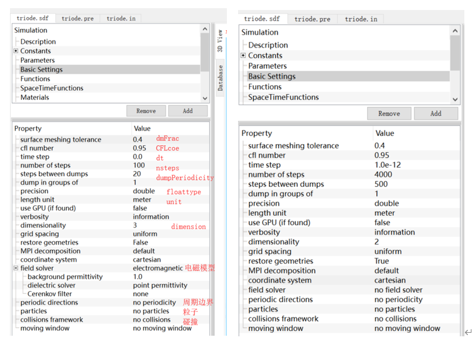

>模型的dmFrac、CFLcoe、dt、nsteps、dumpPeriodicity、floattype、dimension等等参数在Basic Setting模块，这是基础的设置模块，非常重要。

>测试的时候可以改nsteps等简单跑一跑.

# dmFrac (surface meshing tolerance)

一般设置0.25-0.5。VSim的曲面/曲线边界使用的是Cutting-Cell，即在边界处将曲线变为折线，折线和网格相交就会产生一些三角形和梯形网格，这些网格处需要特殊设置电磁场方程和粒子吸收过程。

为了避免太细小的三角形（称为碎片）导致计算效能下降，VSim设置dmFrac参数，**凡是尺寸小于dmFrac网格体积的碎片在计算中被直接忽略**。

# CFLcoe (clf number)

CFL条件乘以的系数，一般设为0.95（小于1.0）。

