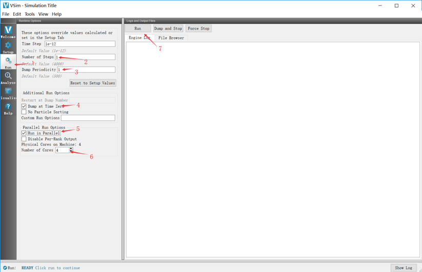

可以通过内置基本几何体组合生成所需要几何体，或者使用stl等导入。

# Add Primitive

右键`CGS`，在`Add Primitive`页可以选择内置的基本几何体.

# Create Array

右键`CGS`或已创建的几何体，在`Create Array`页可以创建线性阵列。

建议先创建单个几何体，然后基于该几何体创建阵列（避免分次设置阵列中的几何体）。

>DX为相邻单元任意对应点的间距（中心间距，不是间隙）。

勾选`Union Created Shapes`会直接创建阵列并合并为一个几何体，也可以先不勾选，之后`Ctrl`选择阵列中的单元自行合并.

>一般要合并成一个才能运行。

注意，计算本质上是基于.pre进行，.sdf可能与.pre有偏差（没办法，程序自己有问题），此时以.pre为准。比如我遇到过.sdf生成的几何模型与.pre需要调用的名称对不上，我的解决方法为手动修改文件名。

# 基础检查

几何建模完成后，Ctrl+s保存模型，运行程序，检查几何建模是否正确。

