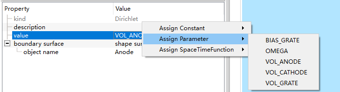

# 场边界条件

在`Basic Settings`页的`field solver`可以选择需要求解的场类型，下面以静电场`electrostatic`为例。

## 边界条件添加

右键`Field Dynamics-FieldBoundaryConditions`页面添加边界条件。其中：
- Dirichiet为第一类边界条件（模型实体等）
- Neumann为第二类边界条件（开放计算边界等）

## 边界条件设置

以设置一个电极的电压为例。可以修改边界条件的名称，并在`boundary surface`下拉选择`shape surface`，之后再出现的`object name`下拉选择电极模型。

边界条件数值`value`可以双击输入设置常量，也可以右键选择别的参数或公式。

