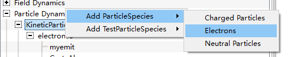
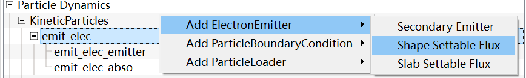
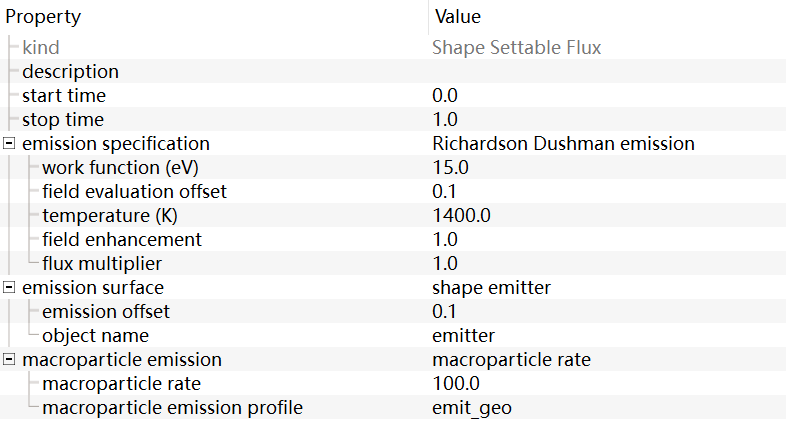
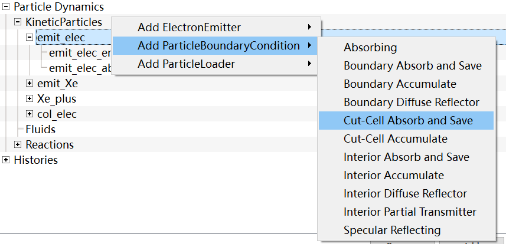
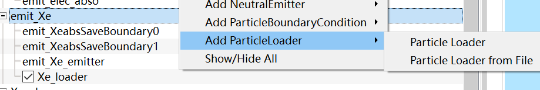

# 粒子建模

在`Basic Settings`页的`particles`可选择是否包含粒子，选择`include particles`以创建粒子模型。

## 电子建模

### 电子发射

右键`Particle Dynamics-KineticParticles`添加粒子，选择添加电子`Electrons`。

电子需要设置归一化权重，即必须设置：
- `nominal density`粒子密度
- `macroparticles per cell`每个网格中的粒子数

假设创建的电子名称为`electrons0`,右键该电子对象添加发射源`emitter`。

其中`Shape Settable Flux`和创建从之前创建的几何体表面上发射电子的发射源，`Slab Settable Flux`可创建从坐标轴上下限发射电子的发射源.

可在`SpaceTimeFunctions`创建基于$H(x)$的配置函数，并在`emitter`对象的`macroparticle emission profile`右键选择函数从而更详细地配置电子发射位置.

### 电子吸收

同理，对电子对象右键弹出的页面中可以创建电子吸收器（边界条件）。一般选用`Cut-Cell Absorb and Save`，该吸收器可设置为在已创建的几何体（一般即阳极）表面吸收电子。

## 中性粒子建模

### 中性粒子发射

中性气体不仅需要创建发射体`emitter`，还需要创建加载器`loader`。

